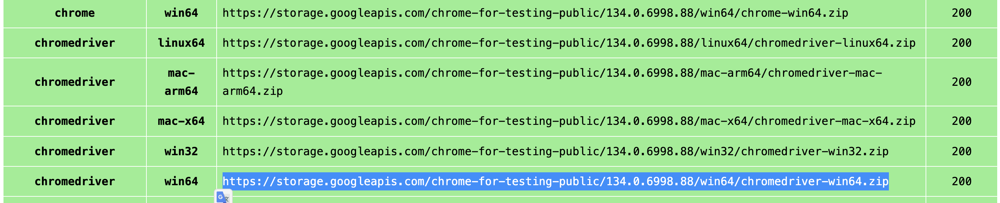

# AgenticSeek: Gizlilik Odaklı, Yerel Manus Alternatifi

<p align="center">

<p>

  English | [中文](./README_CHS.md) | [繁體中文](./README_CHT.md) | [Français](./README_FR.md) | [日本語](./README_JP.md) | [Português (Brasil)](./README_PTBR.md) | [Español](./README_ES.md) | [Türkçe](./README_TR.md)

*Sesli komut destekli bu yapay zeka asistanı, **Manus AI'ya %100 yerel bir alternatiftir**. Web'de otonom olarak gezinir, kod yazar ve görevleri planlar; tüm verilerinizi cihazınızda tutar. Yerel akıl yürütme modelleri için tasarlanmış olup tamamen kendi donanımınızda çalışır, eksiksiz gizlilik ve sıfır bulut bağımlılığı sağlar.*

[](https://fosowl.github.io/agenticSeek.html)  [](https://discord.gg/8hGDaME3TC) [](https://x.com/Martin993886460) [](https://github.com/Fosowl/agenticSeek/stargazers)

### Neden AgenticSeek?

* 🔒 Tamamen Yerel ve Gizli - Her şey kendi makinenizde çalışır — bulut yok, veri paylaşımı yok. Dosyalarınız, konuşmalarınız ve aramalarınız gizli kalır.

* 🌐 Akıllı Web Tarama - AgenticSeek internette kendi başına gezinebilir — arama yapar, okur, bilgi çıkarır, web formlarını doldurur — tamamen eller serbest.

* 💻 Otonom Kodlama Asistanı - Koda mı ihtiyacınız var? Python, C, Go, Java ve daha fazlasında program yazabilir, hata ayıklayabilir ve çalıştırabilir — denetim olmadan.

* 🧠 Akıllı Ajan Seçimi - Siz sorarsınız, o otomatik olarak iş için en uygun ajanı belirler. Elinizin altında uzmanlardan oluşan bir ekip gibi.

* 📋 Karmaşık Görevleri Planlar ve Yürütür - Seyahat planlamasından karmaşık projelere kadar — büyük görevleri adımlara bölebilir ve birden fazla yapay zeka ajanı kullanarak işleri tamamlayabilir.

* 🎙️ Ses Desteği - Temiz, hızlı, fütüristik ses ve konuşmadan metne dönüştürme ile bilim kurgu filmlerindeki kişisel yapay zekanızla konuşuyormuş gibi etkileşim kurabilirsiniz. (Geliştirme aşamasında)

### **Demo**

> *AgenticSeek projesini arayabilir misin, hangi becerilerin gerektiğini öğrenip ardından CV_candidates.zip dosyasını açarak projeye en uygun adayları söyleyebilir misin?*

https://github.com/user-attachments/assets/b8ca60e9-7b3b-4533-840e-08f9ac426316

Uyarı: Bu demo ve görünen tüm dosyalar (ör: CV_candidates.zip) tamamen kurgusaldır. Bir şirket değiliz, aday değil açık kaynak katkıda bulunanlar arıyoruz.

> 🛠⚠️️ **Aktif Olarak Geliştirilmektedir**

> 🙏 Bu proje bir yan proje olarak başladı ve sıfır yol haritası, sıfır finansmanla geliştirilmektedir. GitHub Trending'e girerek beklentilerin çok ötesine geçti. Katkılar, geri bildirimler ve sabır derinden takdir edilmektedir.

## Ön Gereksinimler

Başlamadan önce aşağıdaki yazılımların yüklü olduğundan emin olun:

*   **Git:** Depoyu klonlamak için. [Git İndir](https://git-scm.com/downloads)
*   **Python 3.10.x:** Python 3.10.x sürümünü kullanmanızı şiddetle tavsiye ederiz. Diğer sürümler bağımlılık hatalarına yol açabilir. [Python 3.10 İndir](https://www.python.org/downloads/release/python-3100/) (3.10.x sürümünü seçin).
*   **Docker Engine ve Docker Compose:** SearxNG gibi paketlenmiş servisleri çalıştırmak için.
    *   Docker Desktop yükleyin (Docker Compose V2 dahildir): [Windows](https://docs.docker.com/desktop/install/windows-install/) | [Mac](https://docs.docker.com/desktop/install/mac-install/) | [Linux](https://docs.docker.com/desktop/install/linux-install/)
    *   Alternatif olarak, Linux üzerinde Docker Engine ve Docker Compose'u ayrı ayrı yükleyin: [Docker Engine](https://docs.docker.com/engine/install/) | [Docker Compose](https://docs.docker.com/compose/install/) (Compose V2 yüklediğinizden emin olun, ör: `sudo apt-get install docker-compose-plugin`).

### 1. **Depoyu klonlayın ve kurulumu yapın**

```sh
git clone https://github.com/Fosowl/agenticSeek.git
cd agenticSeek
mv .env.example .env
```

### 2. .env dosyasının içeriğini değiştirin

```sh
SEARXNG_BASE_URL="http://searxng:8080" # değer backend'in nerede çalıştığına bağlıdır — aşağıdaki SEARXNG notuna bakın
SEARXNG_PORT=8080
REDIS_BASE_URL="redis://redis:6379/0"
WORK_DIR="/Users/mlg/Documents/workspace_for_ai"
OLLAMA_PORT="11434"
LM_STUDIO_PORT="1234"
CUSTOM_ADDITIONAL_LLM_PORT="11435"
OPENAI_API_KEY='optional'
DEEPSEEK_API_KEY='optional'
OPENROUTER_API_KEY='optional'
TOGETHER_API_KEY='optional'
GOOGLE_API_KEY='optional'
ANTHROPIC_API_KEY='optional'
```

`.env` dosyasını ihtiyaçlarınıza göre güncelleyin:

- **SEARXNG_PORT**: Docker'ın SearXNG'yi yayınladığı **ana makine (host)** portu. Makinenizde `8080` portu zaten kullanılıyorsa başka bir port ayarlayın (ör. `8001`). Docker içinde konteyner her zaman `8080` portunu dinler — bu değişken bunu asla değiştirmez.
- **SEARXNG_BASE_URL**: **Backend**'in SearXNG'ye ulaşmak için kullandığı adres. Burada, `.env` dosyasında ayarlanır (`config.ini` içinde değil) ve yalnızca backend'in nerede çalıştığına bağlıdır:

| AgenticSeek'i nasıl çalıştırdığınız | `SEARXNG_BASE_URL` |
|---|---|
| Web arayüzü — backend Docker'da (`./start_services.sh full`) | `http://searxng:8080` — `SEARXNG_PORT` değerini değiştirmiş olsanız bile her zaman `8080` portu |
| CLI modu — backend ana makinede (`uv run cli.py`) | `http://localhost:8080` — `SEARXNG_PORT` değerini değiştirdiyseniz onun yerine o portu kullanın (ör. `http://localhost:8001`). `http://searxng:...` burada **çalışmaz**: bu makine adı yalnızca Docker içinde vardır |

> SearXNG'yi tarayıcıda kontrol etmek için her zaman ana makine portunu kullanın: `http://localhost:<SEARXNG_PORT>`. `.env` dosyasını değiştirdikten sonra backend'i yeniden başlatın — dosya yalnızca süreç başlangıcında okunur.
- **REDIS_BASE_URL**: Değiştirmeyin.
- **WORK_DIR**: Yerel makinenizdeki çalışma dizininin yolu. AgenticSeek bu dosyaları okuyabilir ve onlarla etkileşim kurabilir.
- **OLLAMA_PORT**: Ollama servisi için port numarası.
- **LM_STUDIO_PORT**: LM Studio servisi için port numarası.
- **CUSTOM_ADDITIONAL_LLM_PORT**: Ek özel LLM servisi için port.

**API anahtarları, LLM'yi yerel olarak çalıştırmayı tercih eden kullanıcılar için tamamen isteğe bağlıdır. Bu projenin birincil amacı da budur. Yeterli donanımınız varsa boş bırakın.**

### 3. **Docker'ı Başlatın**

Docker'ın sisteminizde yüklü ve çalışır durumda olduğundan emin olun. Docker'ı aşağıdaki komutlarla başlatabilirsiniz:

- **Linux/macOS:**
    Terminal açın ve çalıştırın:
    ```sh
    sudo systemctl start docker
    ```
    Veya yüklüyse Docker Desktop'ı uygulama menüsünden başlatın.

- **Windows:**
    Başlat menüsünden Docker Desktop'ı başlatın.

Docker'ın çalıştığını doğrulamak için:
```sh
docker info
```
Docker kurulumunuz hakkında bilgi görüyorsanız, düzgün çalışıyor demektir.

Özet için aşağıdaki [Yerel Sağlayıcılar](#yerel-sağlayıcılar-listesi) tablosuna bakın.

Sonraki adım: [AgenticSeek'i yerel olarak çalıştırın](#servisleri-başlatın-ve-çalıştırın)

*Sorun yaşıyorsanız [Sorun Giderme](#sorun-giderme) bölümüne bakın.*
*Donanımınız LLM'leri yerel olarak çalıştıramıyorsa [API ile Çalıştırma Kurulumu](#api-ile-çalıştırma-kurulumu) bölümüne bakın.*
*Ayrıntılı `config.ini` açıklamaları için [Yapılandırma](#yapılandırma) bölümüne bakın.*

---

## LLM'yi Makinenizde Yerel Olarak Çalıştırma Kurulumu

**Donanım Gereksinimleri:**

LLM'leri yerel olarak çalıştırmak için yeterli donanıma ihtiyacınız olacaktır. En azından Magistral, Qwen veya Deepseek 14B çalıştırabilecek bir GPU gereklidir. Ayrıntılı model/performans önerileri için SSS bölümüne bakın.

**Yerel sağlayıcınızı ayarlayın**

Yerel sağlayıcınızı başlatın (örneğin ollama ile):

AgenticSeek'i ana makinede (CLI modu) çalıştırmayacaksanız, sağlayıcı dinleme adresini ayarlayın:

```sh
export OLLAMA_HOST=0.0.0.0:11434
```

Ardından sağlayıcınızı başlatın:

```sh
ollama serve
```

Desteklenen yerel sağlayıcıların listesi için aşağıya bakın.

**config.ini dosyasını güncelleyin**

config.ini dosyasında provider_name'i desteklenen bir sağlayıcıya ve provider_model'i sağlayıcınızın desteklediği bir LLM'e ayarlayın. *Magistral* veya *Deepseek* gibi akıl yürütme modellerini öneriyoruz.

Gerekli donanım için README sonundaki **SSS** bölümüne bakın.

```sh
[MAIN]
is_local = True # Yerel mi yoksa uzak sağlayıcı ile mi çalıştırıyorsunuz.
provider_name = ollama # veya lm-studio, openai, vb.
provider_model = deepseek-r1:14b # donanımınıza uygun bir model seçin
provider_server_address = 127.0.0.1:11434
agent_name = Jarvis # yapay zekanızın adı
recover_last_session = True # önceki oturumu kurtarıp kurtarmayacağı
save_session = True # mevcut oturumu hatırlayıp hatırlamayacağı
speak = False # metinden sese dönüştürme
listen = False # sesten metne dönüştürme, yalnızca CLI için, deneysel
jarvis_personality = False # daha "Jarvis" benzeri bir kişilik kullanıp kullanmayacağı (deneysel)
languages = en zh # Dil listesi, metinden sese varsayılan olarak listedeki ilk dili kullanır
[BROWSER]
headless_browser = True # CLI modunda değilseniz değiştirmeyin.
stealth_mode = True # Tarayıcı algılamasını azaltmak için gizli selenium kullanır
```

**Uyarı**:

- `config.ini` dosya biçimi yorum satırlarını desteklemez.
Örnek yapılandırmayı doğrudan kopyalayıp yapıştırmayın, çünkü yorum satırları hatalara neden olur. Bunun yerine `config.ini` dosyasını yorum satırları olmadan istediğiniz ayarlarla manuel olarak düzenleyin.

- LLM çalıştırmak için LM-studio kullanıyorsanız provider_name'i `openai` olarak *AYARLAMAYIN*. `lm-studio` olarak ayarlayın.

- Bazı sağlayıcılar (ör: lm-studio) IP'nin önünde `http://` gerektirir. Örneğin: `http://127.0.0.1:1234`

**Yerel Sağlayıcılar Listesi**

| Sağlayıcı  | Yerel mi? | Açıklama                                               |
|-----------|--------|-----------------------------------------------------------|
| ollama    | Evet    | Ollama kullanarak LLM'leri kolayca yerel olarak çalıştırın |
| lm-studio  | Evet    | LM Studio ile LLM'leri yerel olarak çalıştırın (`provider_name` değerini `lm-studio` olarak ayarlayın)|
| openai    | Evet     |  OpenAI uyumlu API kullanın (ör: llama.cpp sunucusu)  |

Sonraki adım: [Servisleri başlatın ve AgenticSeek'i çalıştırın](#servisleri-başlatın-ve-çalıştırın)

*Sorun yaşıyorsanız [Sorun Giderme](#sorun-giderme) bölümüne bakın.*
*Donanımınız LLM'leri yerel olarak çalıştıramıyorsa [API ile Çalıştırma Kurulumu](#api-ile-çalıştırma-kurulumu) bölümüne bakın.*
*Ayrıntılı `config.ini` açıklamaları için [Yapılandırma](#yapılandırma) bölümüne bakın.*

## API ile Çalıştırma Kurulumu

Bu kurulum harici, bulut tabanlı LLM sağlayıcılarını kullanır. Seçtiğiniz servisten bir API anahtarına ihtiyacınız olacaktır.

**1. Bir API Sağlayıcısı Seçin ve API Anahtarı Alın:**

Aşağıdaki [API Sağlayıcıları Listesi](#api-sağlayıcıları-listesi) bölümüne bakın. Kaydolmak ve API anahtarı almak için web sitelerini ziyaret edin.

**2. API Anahtarınızı Ortam Değişkeni Olarak Ayarlayın:**

*   **Linux/macOS:**
    Terminal açın ve `export` komutunu kullanın. Kalıcılık için bunu shell profil dosyanıza (ör: `~/.bashrc`, `~/.zshrc`) eklemeniz önerilir.
    ```sh
    export PROVIDER_API_KEY="api_anahtarınız"
    # PROVIDER_API_KEY'i ilgili değişken adıyla değiştirin, ör: OPENAI_API_KEY, GOOGLE_API_KEY
    ```
    TogetherAI örneği:
    ```sh
    export TOGETHER_API_KEY="xxxxxxxxxxxxxxxxxxxxxx"
    ```
*   **Windows:**
    *   **Komut İstemi (Geçerli oturum için geçici):**
        ```cmd
        set PROVIDER_API_KEY=api_anahtarınız
        ```
    *   **PowerShell (Geçerli oturum için geçici):**
        ```powershell
        $env:PROVIDER_API_KEY="api_anahtarınız"
        ```
    *   **Kalıcı:** Windows arama çubuğunda "ortam değişkenleri" arayın, "Sistem ortam değişkenlerini düzenle" seçeneğine tıklayın, ardından "Ortam Değişkenleri..." düğmesine tıklayın. Uygun adla (ör: `OPENAI_API_KEY`) yeni bir Kullanıcı değişkeni ekleyin ve değer olarak anahtarınızı girin.

    *(Daha fazla ayrıntı için SSS: [API anahtarlarını nasıl ayarlarım?](#api-anahtarlarını-nasıl-ayarlarım) bölümüne bakın.)*


**3. `config.ini` Dosyasını Güncelleyin:**
```ini
[MAIN]
is_local = False
provider_name = openai # Veya google, deepseek, togetherAI, huggingface
provider_model = gpt-3.5-turbo # Veya gemini-1.5-flash, deepseek-chat, mistralai/Mixtral-8x7B-Instruct-v0.1 vb.
provider_server_address = # is_local = False olduğunda çoğu API için genellikle yok sayılır veya boş bırakılabilir
# ... diğer ayarlar ...
```
*Uyarı:* config.ini değerlerinin sonunda boşluk olmadığından emin olun.

**API Sağlayıcıları Listesi**

| Sağlayıcı     | `provider_name` | Yerel mi? | Açıklama                                       | API Anahtarı Bağlantısı (Örnekler)                     |
|--------------|-----------------|--------|---------------------------------------------------|---------------------------------------------|
| OpenAI       | `openai`        | Hayır     | OpenAI API'si üzerinden ChatGPT modellerini kullanın.              | [platform.openai.com/signup](https://platform.openai.com/signup) |
| Google Gemini| `google`        | Hayır     | Google AI Studio üzerinden Google Gemini modellerini kullanın.    | [aistudio.google.com/keys](https://aistudio.google.com/keys) |
| Deepseek     | `deepseek`      | Hayır     | Deepseek API'si üzerinden Deepseek modellerini kullanın.                | [platform.deepseek.com](https://platform.deepseek.com) |
| Hugging Face | `huggingface`   | Hayır     | Hugging Face Inference API'den modelleri kullanın.       | [huggingface.co/settings/tokens](https://huggingface.co/settings/tokens) |
| TogetherAI   | `togetherAI`    | Hayır     | TogetherAI API'si üzerinden çeşitli açık kaynak modelleri kullanın.| [api.together.ai/settings/api-keys](https://api.together.ai/settings/api-keys) |
| OpenRouter   | `openrouter`    | Hayır     | OpenRouter Modellerini kullanın| [https://openrouter.ai/](https://openrouter.ai/) |

*Not:*
*   Karmaşık web tarama ve görev planlama için `gpt-4o` veya diğer OpenAI modellerini kullanmanızı önermiyoruz, çünkü mevcut prompt optimizasyonları Deepseek gibi modellere yöneliktir.
*   Kodlama/bash görevleri Gemini ile sorun yaşayabilir, çünkü Deepseek için optimize edilmiş biçimlendirme talimatlarına kesinlikle uymayabilir.
*   `is_local = False` olduğunda `config.ini` içindeki `provider_server_address` genellikle kullanılmaz, çünkü API uç noktaları genellikle ilgili sağlayıcı kütüphanesinde sabit kodlanmıştır.

Sonraki adım: [Servisleri başlatın ve AgenticSeek'i çalıştırın](#servisleri-başlatın-ve-çalıştırın)

*Sorun yaşıyorsanız **Bilinen Sorunlar** bölümüne bakın*

*Ayrıntılı yapılandırma dosyası açıklamaları için **Yapılandırma** bölümüne bakın.*

---

## Servisleri Başlatın ve Çalıştırın

Varsayılan olarak AgenticSeek tamamen Docker içinde çalıştırılır.

**Seçenek 1:** Docker'da çalıştırın, web arayüzünü kullanın:

Gerekli servisleri başlatın. Bu, docker-compose.yml'deki tüm servisleri başlatacaktır:
    - searxng
    - redis (searxng için gerekli)
    - frontend
    - backend (web arayüzü kullanırken `full` parametresi ile)

```sh
./start_services.sh full # MacOS
start start_services.cmd full # Windows
```

**Uyarı:** Bu adım tüm Docker imajlarını indirip yükleyecektir, bu işlem 30 dakikaya kadar sürebilir. Servisleri başlattıktan sonra, herhangi bir mesaj göndermeden önce backend servisinin tamamen çalışır duruma gelmesini bekleyin (loglarda **backend: "GET /health HTTP/1.1" 200 OK** mesajını görmelisiniz). İlk çalıştırmada backend servisinin başlaması 5 dakika sürebilir.

`http://localhost:3000/` adresine gidin ve web arayüzünü görmelisiniz.

*Servis başlatma sorun giderme:* Bu betikler başarısız olursa, Docker Engine'in çalıştığından ve Docker Compose'un (V2, `docker compose`) doğru şekilde yüklendiğinden emin olun. Hata mesajları için terminal çıktısını kontrol edin. Bkz. [SSS: AgenticSeek'i veya betiklerini çalıştırırken hata alıyorum.](#sss-sorun-giderme)

**Seçenek 2:** CLI modu:

CLI arayüzü ile çalıştırmak için paketleri ana makineye yüklemeniz gerekir:

```sh
./install.sh
./install.bat # windows
```

Ardından, CLI modunda backend Docker'ın dışında, kendi makinenizde çalıştığı için `.env` dosyanızdaki (`config.ini` **değil**) SEARXNG_BASE_URL değerini ana makineye eşlenen adresle değiştirmelisiniz:

```sh
SEARXNG_BASE_URL="http://localhost:8080"
```

> `.env` dosyasında `SEARXNG_PORT` değerini değiştirdiyseniz, burada onun yerine o portu kullanın (ör. `http://localhost:8001`). `.env` dosyasını düzenledikten sonra `cli.py`'yi yeniden başlatın — değer başlangıçta okunur.

Gerekli servisleri başlatın. Bu, docker-compose.yml'deki bazı servisleri başlatacaktır:
    - searxng
    - redis (searxng için gerekli)
    - frontend

```sh
./start_services.sh # MacOS
start start_services.cmd # Windows
```

Çalıştırın: `uv run python -m ensurepip` komutu ile uv'nin pip'i etkin olduğundan emin olun.

CLI'yi kullanın: `uv run cli.py`

---

## Kullanım

Servislerin `./start_services.sh full` ile çalıştığından emin olun ve web arayüzü için `localhost:3000` adresine gidin.

Yapılandırmada `listen = True` ayarlayarak konuşmadan metne dönüştürmeyi de kullanabilirsiniz. Yalnızca CLI modu için.

Çıkmak için `goodbye` yazın/söyleyin.

İşte bazı kullanım örnekleri:

> *Python'da bir yılan oyunu yap!*

> *Rennes, Fransa'daki en iyi kafeleri internette ara ve adres bilgileriyle birlikte üçünü rennes_cafes.txt dosyasına kaydet.*

> *Bir sayının faktöriyelini hesaplayan bir Go programı yaz, çalışma alanına factorial.go olarak kaydet*

> *summer_pictures klasöründeki tüm JPG dosyalarını ara, bugünün tarihiyle yeniden adlandır ve yeniden adlandırılan dosyaların listesini photos_list.txt dosyasına kaydet*

> *2024'ün popüler bilim kurgu filmlerini internette ara ve bu gece izlemek için üçünü seç. Listeyi movie_night.txt dosyasına kaydet.*

> *2025'in en son yapay zeka haberleri makalelerini internette ara, üçünü seç ve başlıklarını ve özetlerini kazımak için bir Python betiği yaz. Betiği news_scraper.py olarak ve özetleri /home/projects içinde ai_news.txt olarak kaydet*

> *Cuma, internette ücretsiz bir hisse senedi fiyat API'si ara, supersuper7434567@gmail.com ile kaydol ve ardından API'yi kullanarak Tesla'nın günlük fiyatlarını çekmek için bir Python betiği yaz, sonuçları stock_prices.csv dosyasına kaydet*

*Form doldurma yeteneklerinin hâlâ deneysel olduğunu ve başarısız olabileceğini unutmayın.*

Sorgunuzu yazdıktan sonra AgenticSeek göreve en uygun ajanı atayacaktır.

Bu erken bir prototip olduğundan, ajan yönlendirme sistemi sorgunuza göre her zaman doğru ajanı atamayabilir.

Bu nedenle, ne istediğiniz ve yapay zekanın nasıl ilerlemesi gerektiği konusunda çok açık olun. Örneğin, web araması yapmasını istiyorsanız şunu demeyin:

`Solo seyahat için iyi ülkeler biliyor musun?`

Bunun yerine şöyle sorun:

`Web araması yap ve solo seyahat için en iyi ülkeleri bul`

---

## **LLM'yi Kendi Sunucunuzda Çalıştırma Kurulumu**

Güçlü bir bilgisayarınız veya kullanabileceğiniz bir sunucunuz varsa, ancak dizüstü bilgisayarınızdan kullanmak istiyorsanız, özel LLM sunucumuzu kullanarak LLM'yi uzak bir sunucuda çalıştırma seçeneğiniz vardır.

Yapay zeka modelini çalıştıracak "sunucunuzda" IP adresini alın

```sh
ip a | grep "inet " | grep -v 127.0.0.1 | awk '{print $2}' | cut -d/ -f1 # yerel IP
curl https://ipinfo.io/ip # genel IP
```

Not: Windows veya macOS için IP adresini bulmak üzere sırasıyla ipconfig veya ifconfig kullanın.

Depoyu klonlayın ve `server/` klasörüne girin.

```sh
git clone --depth 1 https://github.com/Fosowl/agenticSeek.git
cd agenticSeek/llm_server/
```

Sunucuya özel gereksinimleri yükleyin:

```sh
pip3 install -r requirements.txt
```

Sunucu betiğini çalıştırın.

```sh
python3 app.py --provider ollama --port 3333
```

LLM servisi olarak `ollama` veya `llamacpp` arasında seçim yapabilirsiniz.

Şimdi kişisel bilgisayarınızda:

`config.ini` dosyasında `provider_name` değerini `server` ve `provider_model` değerini `deepseek-r1:xxb` olarak ayarlayın.
`provider_server_address` değerini modeli çalıştıracak makinenin IP adresine ayarlayın.

```sh
[MAIN]
is_local = False
provider_name = server
provider_model = deepseek-r1:70b
provider_server_address = http://x.x.x.x:3333
```

Sonraki adım: [Servisleri başlatın ve AgenticSeek'i çalıştırın](#servisleri-başlatın-ve-çalıştırın)

---

## Konuşmadan Metne

Uyarı: Konuşmadan metne özelliği şu anda yalnızca CLI modunda çalışmaktadır.

Konuşmadan metne özelliğinin şu anda yalnızca İngilizce dilinde çalıştığını lütfen unutmayın.

Konuşmadan metne işlevi varsayılan olarak devre dışıdır. Etkinleştirmek için config.ini dosyasında listen seçeneğini True olarak ayarlayın:

```
listen = True
```

Etkinleştirildiğinde, konuşmadan metne özelliği girdinizi işlemeye başlamadan önce bir tetikleyici anahtar kelimeyi (ajanın adı) dinler. Ajanın adını *config.ini* dosyasındaki `agent_name` değerini güncelleyerek özelleştirebilirsiniz:

```
agent_name = Friday
```

En iyi tanıma performansı için ajan adı olarak "John" veya "Emma" gibi yaygın bir İngilizce isim kullanmanızı öneririz.

Transkript görünmeye başladığında, uyandırmak için ajanın adını yüksek sesle söyleyin (ör: "Friday").

Sorgunuzu net bir şekilde söyleyin.

Sisteme devam etmesi gerektiğini bildirmek için isteğinizi bir onay ifadesiyle bitirin. Onay ifadesi örnekleri:
```
"do it", "go ahead", "execute", "run", "start", "thanks", "would ya", "please", "okay?", "proceed", "continue", "go on", "do that", "go it", "do you understand?"
```

## Yapılandırma

Örnek yapılandırma:
```
[MAIN]
is_local = True
provider_name = ollama
provider_model = deepseek-r1:32b
provider_server_address = http://127.0.0.1:11434 # Ollama örneği; LM-Studio için http://127.0.0.1:1234 kullanın
agent_name = Friday
recover_last_session = False
save_session = False
speak = False
listen = False

jarvis_personality = False
languages = en zh # TTS ve potansiyel yönlendirme için dil listesi.
[BROWSER]
headless_browser = False
stealth_mode = False
```

**`config.ini` Ayarlarının Açıklaması**:

*   **`[MAIN]` Bölümü:**
    *   `is_local`: Yerel LLM sağlayıcısı (Ollama, LM-Studio, yerel OpenAI uyumlu sunucu) veya kendi barındırdığınız sunucu seçeneğini kullanıyorsanız `True`. Bulut tabanlı API (OpenAI, Google, vb.) kullanıyorsanız `False`.
    *   `provider_name`: LLM sağlayıcısını belirtir.
        *   Yerel seçenekler: `ollama`, `lm-studio`, `openai` (yerel OpenAI uyumlu sunucular için), `server` (kendi barındırdığınız sunucu kurulumu için).
        *   API seçenekleri: `openai`, `google`, `deepseek`, `huggingface`, `togetherAI`.
    *   `provider_model`: Seçilen sağlayıcı için belirli model adı veya kimliği (ör: Ollama için `deepseekcoder:6.7b`, OpenAI API için `gpt-3.5-turbo`, TogetherAI için `mistralai/Mixtral-8x7B-Instruct-v0.1`).
    *   `provider_server_address`: LLM sağlayıcınızın adresi.
        *   Yerel sağlayıcılar için: ör: Ollama için `http://127.0.0.1:11434`, LM-Studio için `http://127.0.0.1:1234`.
        *   `server` sağlayıcı türü için: Kendi barındırdığınız LLM sunucunuzun adresi (ör: `http://sunucu_ip_adresiniz:3333`).
        *   Bulut API'leri (`is_local = False`) için: Genellikle yok sayılır veya boş bırakılabilir, çünkü API uç noktası genellikle istemci kütüphanesi tarafından işlenir.
    *   `agent_name`: Yapay zeka asistanının adı (ör: Friday). Etkinleştirilmişse konuşmadan metne için tetikleyici kelime olarak kullanılır.
    *   `recover_last_session`: Önceki oturumun durumunu kurtarmaya çalışmak için `True`, yeni başlamak için `False`.
    *   `save_session`: Mevcut oturumun durumunu olası kurtarma için kaydetmek için `True`, aksi takdirde `False`.
    *   `speak`: Metinden sese sesli çıktıyı etkinleştirmek için `True`, devre dışı bırakmak için `False`.
    *   `listen`: Konuşmadan metne sesli girdiyi etkinleştirmek için `True` (yalnızca CLI modu), devre dışı bırakmak için `False`.
    *   `work_dir`: **Kritik:** AgenticSeek'in dosya okuyacağı/yazacağı dizin. **Bu yolun sisteminizde geçerli ve erişilebilir olduğundan emin olun.**
    *   `jarvis_personality`: Daha "Jarvis-benzeri" bir sistem istemi kullanmak için `True` (deneysel), standart istem için `False`.
    *   `languages`: Virgülle ayrılmış dil listesi (ör: `en, zh, fr`). TTS ses seçimi için kullanılır (varsayılan olarak ilki) ve LLM yönlendiricisine yardımcı olabilir. Yönlendirici verimliliği için çok fazla veya çok benzer dil kullanmaktan kaçının.
*   **`[BROWSER]` Bölümü:**
    *   `headless_browser`: Otomatik tarayıcıyı görünür pencere olmadan çalıştırmak için `True` (web arayüzü veya etkileşimsiz kullanım için önerilir). Tarayıcı penceresini göstermek için `False` (CLI modu veya hata ayıklama için kullanışlıdır).
    *   `stealth_mode`: Tarayıcı otomasyonunun tespit edilmesini zorlaştıran önlemleri etkinleştirmek için `True`. Anticaptcha gibi tarayıcı eklentilerinin manuel olarak yüklenmesini gerektirebilir.

Bu bölüm desteklenen LLM sağlayıcı türlerini özetler. `config.ini` dosyasında yapılandırın.

**Yerel Sağlayıcılar (Kendi Donanımınızda Çalışır):**

| `config.ini`'deki Sağlayıcı Adı | `is_local` | Açıklama                                                                 | Kurulum Bölümü                                                    |
|-------------------------------|------------|-----------------------------------------------------------------------------|------------------------------------------------------------------|
| `ollama`                      | `True`     | Ollama kullanarak yerel LLM'leri sunun.                                             | [LLM'yi yerel olarak çalıştırma kurulumu](#llmyi-makinenizde-yerel-olarak-çalıştırma-kurulumu) |
| `lm-studio`                   | `True`     | LM-Studio kullanarak yerel LLM'leri sunun.                                          | [LLM'yi yerel olarak çalıştırma kurulumu](#llmyi-makinenizde-yerel-olarak-çalıştırma-kurulumu) |
| `openai` (yerel sunucu için)   | `True`     | OpenAI uyumlu API sunan yerel bir sunucuya bağlanın (ör: llama.cpp). | [LLM'yi yerel olarak çalıştırma kurulumu](#llmyi-makinenizde-yerel-olarak-çalıştırma-kurulumu) |
| `server`                      | `False`    | Başka bir makinede çalışan AgenticSeek kendi barındırmalı LLM sunucusuna bağlanın. | [LLM'yi kendi sunucunuzda çalıştırma kurulumu](#llmyi-kendi-sunucunuzda-çalıştırma-kurulumu) |

**API Sağlayıcıları (Bulut Tabanlı):**

| `config.ini`'deki Sağlayıcı Adı | `is_local` | Açıklama                                      | Kurulum Bölümü                                       |
|-------------------------------|------------|--------------------------------------------------|-----------------------------------------------------|
| `openai`                      | `False`    | OpenAI'ın resmi API'sini kullanın (ör: GPT-3.5, GPT-4). | [API ile çalıştırma kurulumu](#api-ile-çalıştırma-kurulumu) |
| `google`                      | `False`    | Google Gemini modellerini API üzerinden kullanın.              | [API ile çalıştırma kurulumu](#api-ile-çalıştırma-kurulumu) |
| `deepseek`                    | `False`    | Deepseek'in resmi API'sini kullanın.                     | [API ile çalıştırma kurulumu](#api-ile-çalıştırma-kurulumu) |
| `huggingface`                 | `False`    | Hugging Face Inference API'yi kullanın.                  | [API ile çalıştırma kurulumu](#api-ile-çalıştırma-kurulumu) |
| `togetherAI`                  | `False`    | TogetherAI API'si üzerinden çeşitli açık modelleri kullanın.    | [API ile çalıştırma kurulumu](#api-ile-çalıştırma-kurulumu) |

---
## Sorun Giderme

Sorunlarla karşılaşırsanız bu bölüm rehberlik sağlar.

# Bilinen Sorunlar

## ChromeDriver Sorunları

**Hata Örneği:** `SessionNotCreatedException: Message: session not created: This version of ChromeDriver only supports Chrome version XXX`

### Temel Neden
ChromeDriver sürüm uyumsuzluğu şu durumlarda oluşur:
1. Yüklü ChromeDriver sürümünüz Chrome tarayıcı sürümünüzle eşleşmiyor
2. Docker ortamlarında `undetected_chromedriver`, bağlanan ikili dosyayı atlayarak kendi ChromeDriver sürümünü indirebilir

### Çözüm Adımları

#### 1. Chrome Sürümünüzü Kontrol Edin
Google Chrome'u açın → `Ayarlar > Chrome Hakkında` bölümünden sürümünüzü bulun (ör: "Sürüm 134.0.6998.88")

#### 2. Eşleşen ChromeDriver'ı İndirin

**Chrome 115 ve sonrası için:** [Chrome for Testing API](https://googlechromelabs.github.io/chrome-for-testing/) kullanın
- Chrome for Testing uygunluk panosunu ziyaret edin
- Chrome sürümünüzü veya en yakın eşleşmeyi bulun
- İşletim sisteminiz için ChromeDriver'ı indirin (Docker ortamları için Linux64)

**Eski Chrome sürümleri için:** [Eski ChromeDriver indirmeleri](https://chromedriver.chromium.org/downloads) kullanın



#### 3. ChromeDriver'ı Yükleyin (Bir Yöntem Seçin)

**Yöntem A: Proje Kök Dizini (Docker için Önerilir)**
```bash
# İndirilen chromedriver ikili dosyasını proje kök dizinine yerleştirin
cp path/to/downloaded/chromedriver ./chromedriver
chmod +x ./chromedriver  # Linux/macOS'ta çalıştırılabilir yapın
```

**Yöntem B: Sistem PATH'i**
```bash
# Linux/macOS
sudo mv chromedriver /usr/local/bin/
sudo chmod +x /usr/local/bin/chromedriver

# Windows: chromedriver.exe dosyasını PATH'inizdeki bir klasöre yerleştirin
```

#### 4. Kurulumu Doğrulayın
```bash
# ChromeDriver sürümünü test edin
./chromedriver --version
# Veya PATH'teyse:
chromedriver --version
```

### Docker'a Özel Notlar

⚠️ **Docker Kullanıcıları İçin Önemli:**
- Docker volume mount yaklaşımı gizli modda (`undetected_chromedriver`) çalışmayabilir
- **Çözüm**: ChromeDriver'ı proje kök dizinine `./chromedriver` olarak yerleştirin
- Uygulama bu ikili dosyayı otomatik olarak algılayıp kullanacaktır
- Loglarda şunu görmelisiniz: `"Using ChromeDriver from project root: ./chromedriver"`

### Sorun Giderme İpuçları

1. **Hâlâ sürüm uyumsuzluğu mu var?**
   - ChromeDriver'ın çalıştırılabilir olduğunu doğrulayın: `ls -la ./chromedriver`
   - ChromeDriver sürümünü kontrol edin: `./chromedriver --version`
   - Chrome tarayıcı sürümünüzle eşleştiğinden emin olun

2. **Docker container sorunları mı var?**
   - Backend loglarını kontrol edin: `docker logs backend`
   - Şu mesajı arayın: `"Using ChromeDriver from project root"`
   - Bulunamazsa dosyanın var olduğunu ve çalıştırılabilir olduğunu doğrulayın

3. **Chrome for Testing sürümleri**
   - Mümkün olduğunca tam sürüm eşleşmesi kullanın
   - 134.0.6998.88 sürümü için ChromeDriver 134.0.6998.165 kullanın (en yakın mevcut sürüm)
   - Ana sürüm numaraları eşleşmelidir (134 = 134)

### Sürüm Uyumluluk Matrisi

| Chrome Sürümü | ChromeDriver Sürümü | Durum |
|----------------|---------------------|---------|
| 134.0.6998.x   | 134.0.6998.165     | ✅ Çalışır |
| 133.0.6943.x   | 133.0.6943.141     | ✅ Çalışır |
| 132.0.6834.x   | 132.0.6834.159     | ✅ Çalışır |

*En güncel uyumluluk için [Chrome for Testing panosunu](https://googlechromelabs.github.io/chrome-for-testing/) kontrol edin*

`Exception: Failed to initialize browser: Message: session not created: This version of ChromeDriver only supports Chrome version 113
Current browser version is 134.0.6998.89 with binary path`

Bu hata, tarayıcınız ve chromedriver sürümü arasında uyumsuzluk varsa oluşur.

En son sürümü indirmek için şu adrese gidin:

https://developer.chrome.com/docs/chromedriver/downloads

Chrome sürüm 115 veya daha yenisini kullanıyorsanız:

https://googlechromelabs.github.io/chrome-for-testing/

adresinden işletim sisteminize uygun chromedriver sürümünü indirin.


Bu bölüm eksikse lütfen bir issue açın.

## Bağlantı Adaptörü Sorunları

```
Exception: Provider lm-studio failed: HTTP request failed: No connection adapters were found for '127.0.0.1:1234/v1/chat/completions'` (Not: port değişebilir)
```

*   **Neden:** `config.ini` dosyasında `lm-studio` (veya benzeri yerel OpenAI uyumlu sunucular) için `provider_server_address` değerinde `http://` öneki eksik veya yanlış porta yönlendiriliyor.
*   **Çözüm:**
    *   Adresin `http://` içerdiğinden emin olun. LM-Studio varsayılan olarak genellikle `http://127.0.0.1:1234` kullanır.
    *   Doğru `config.ini`: `provider_server_address = http://127.0.0.1:1234` (veya gerçek LM-Studio sunucu portunuz).

## SearxNG Temel URL'si Belirtilmemiş

```
raise ValueError("SearxNG base URL must be provided either as an argument or via the SEARXNG_BASE_URL environment variable.")
ValueError: SearxNG base URL must be provided either as an argument or via the SEARXNG_BASE_URL environment variable.`
```

Bu hata, CLI modunu yanlış SearxNG temel URL'si ile çalıştırdığınızda oluşabilir.

`SEARXNG_BASE_URL`, `.env` dosyasında ayarlanır ve yalnızca **backend'in nerede çalıştığına** bağlıdır:

**Backend ana makinede (CLI modu)**: `SEARXNG_BASE_URL="http://localhost:8080"` — `SEARXNG_PORT` değerini değiştirdiyseniz onun yerine o portu kullanın (ör. `http://localhost:8001`). `http://searxng:...` burada **çalışmaz**: bu makine adı yalnızca Docker içinde çözümlenir.

**Backend Docker'da (web arayüzü, `full` profili)**: `SEARXNG_BASE_URL="http://searxng:8080"` — `SEARXNG_PORT` değerini değiştirmiş olsanız bile her zaman `8080` portu; bu değişken yalnızca ana makine tarafındaki portu yeniden eşler.

> **Port çakışmaları hakkında not**: Ana makinenizde `8080` portu zaten kullanımdaysa, `.env` dosyasında `SEARXNG_PORT` değerini ayarlayın (ör. `8001`), ardından:
> - Web arayüzü (backend Docker'da): `SEARXNG_BASE_URL="http://searxng:8080"` olarak bırakın — iç Docker portu değişmez.
> - CLI modu (backend ana makinede): `SEARXNG_BASE_URL="http://localhost:8001"` olarak ayarlayın — `SEARXNG_PORT` ile eşleşmelidir.
> - Tarayıcı kontrolleri: `http://localhost:<SEARXNG_PORT>` adresini açın — eski `8080` portunda yanıt veren şey AgenticSeek'in SearXNG'si değil, başka bir uygulamadır.
>
> `.env` dosyasını değiştirdikten sonra backend'i (`api.py` veya `cli.py`) yeniden başlatın — dosya yalnızca süreç başlangıcında okunur.

## SSS

**S: Hangi donanıma ihtiyacım var?**

| Model Boyutu  | GPU  | Yorum                                               |
|-----------|--------|-----------------------------------------------------------|
| 7B        | 8GB VRAM | ⚠️ Önerilmez. Düşük performans, sık halüsinasyonlar ve planlayıcı ajanlar büyük olasılıkla başarısız olur. |
| 14B        | 12 GB VRAM (ör: RTX 3060) | ✅ Basit görevler için kullanılabilir. Web tarama ve planlama görevlerinde zorlanabilir. |
| 32B        | 24+ GB VRAM (ör: RTX 4090) | 🚀 Çoğu görevde başarılı, görev planlamasında hâlâ zorlanabilir |
| 70B+        | 48+ GB VRAM | 💪 Mükemmel. Gelişmiş kullanım senaryoları için önerilir. |

**S: Hata alıyorum, ne yapmalıyım?**

Yerel sunucunun çalıştığından (`ollama serve`), `config.ini` dosyanızın sağlayıcınızla eşleştiğinden ve bağımlılıkların yüklü olduğundan emin olun. Hiçbiri işe yaramazsa bir issue açmaktan çekinmeyin.

**S: Gerçekten %100 yerel çalışabilir mi?**

Evet, Ollama, lm-studio veya server sağlayıcıları ile tüm konuşmadan metne, LLM ve metinden sese modelleri yerel olarak çalışır. Yerel olmayan seçenekler (OpenAI veya diğer API'ler) isteğe bağlıdır.

**S: Manus varken neden AgenticSeek kullanmalıyım?**

Manus'un aksine, AgenticSeek harici sistemlerden bağımsızlığa öncelik verir, size daha fazla kontrol, gizlilik ve API maliyetinden kaçınma imkânı sunar.

**S: Projenin arkasında kim var?**

Proje benim tarafımdan, bakımcı olarak görev yapan iki arkadaşım ve GitHub'daki açık kaynak topluluğundan katkıda bulunanlarla birlikte oluşturuldu. Bir startup veya herhangi bir kuruluşla bağlantılı değiliz, sadece tutkulu bireylerden oluşan bir grubuz.

X'te kişisel hesabım (https://x.com/Martin993886460) dışındaki herhangi bir AgenticSeek hesabı taklittir.

## Katkıda Bulunma

AgenticSeek'i geliştirmek için geliştiriciler arıyoruz! Açık issue'lara veya tartışmalara göz atın.

[Katkıda bulunma rehberi](./docs/CONTRIBUTING.md)


## Sponsorlar:

AgenticSeek'in yeteneklerini uçuş arama, seyahat planlama veya en iyi alışveriş fırsatlarını yakalama gibi özelliklerle geliştirmek ister misiniz? Daha fazla Jarvis benzeri yetenek açmak için SerpApi ile özel bir araç oluşturmayı düşünün. SerpApi ile, tam kontrolü elinizde tutarken ajanınızı özel görevler için güçlendirebilirsiniz.

<a href="https://serpapi.com/"></a>

Özel araçları nasıl entegre edeceğinizi öğrenmek için [Contributing.md](./docs/CONTRIBUTING.md) dosyasına bakın!

## Bakımcılar:

 > [Fosowl](https://github.com/Fosowl) | Paris Saati

## Özel Teşekkürler:

 > [tcsenpai](https://github.com/tcsenpai) ve [plitc](https://github.com/plitc) Backend dockerizasyonuna yardımları için

[](https://www.star-history.com/#Fosowl/agenticSeek&Date)
